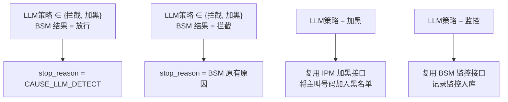
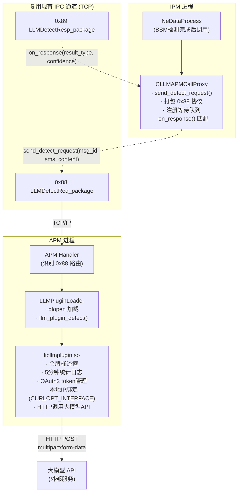
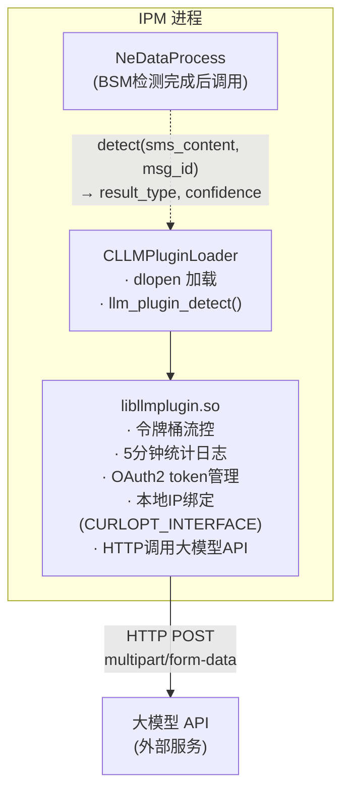
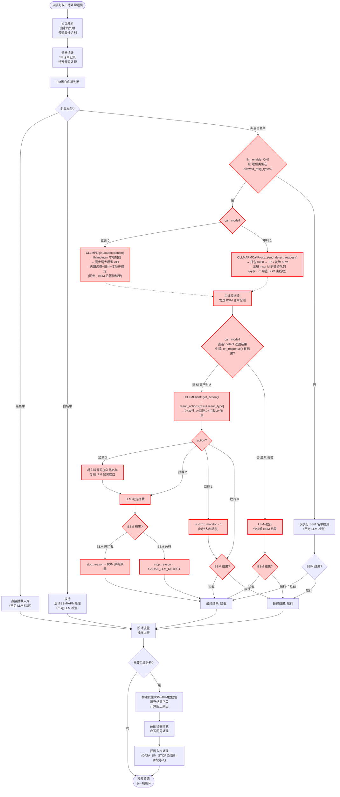
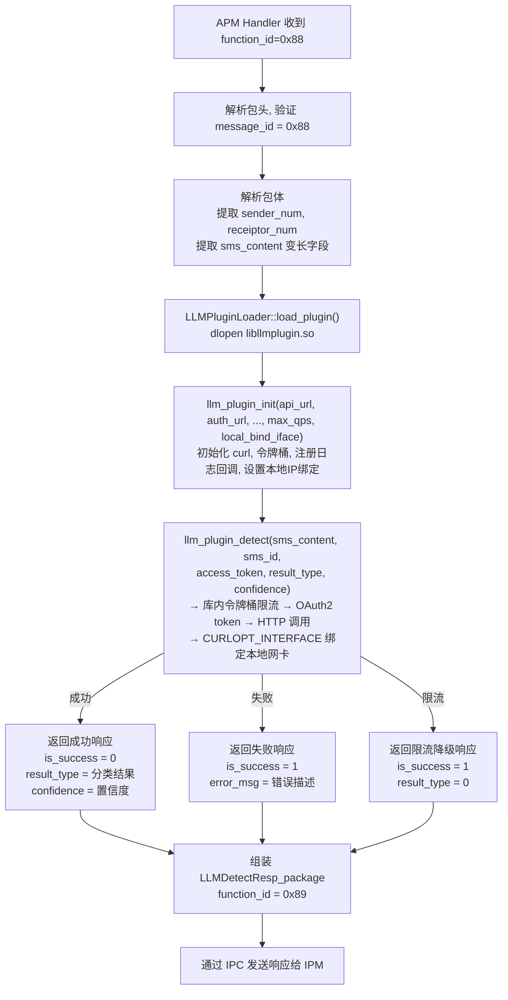
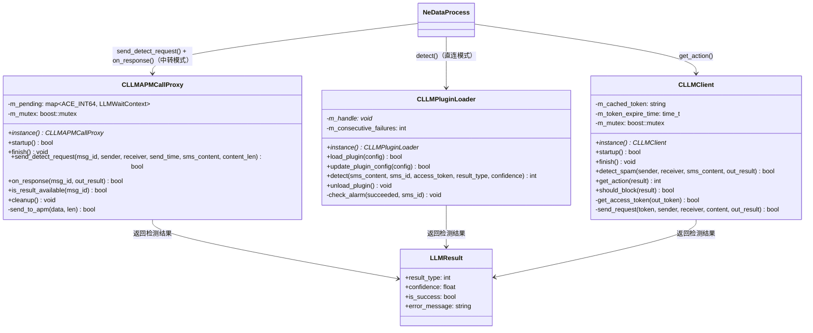
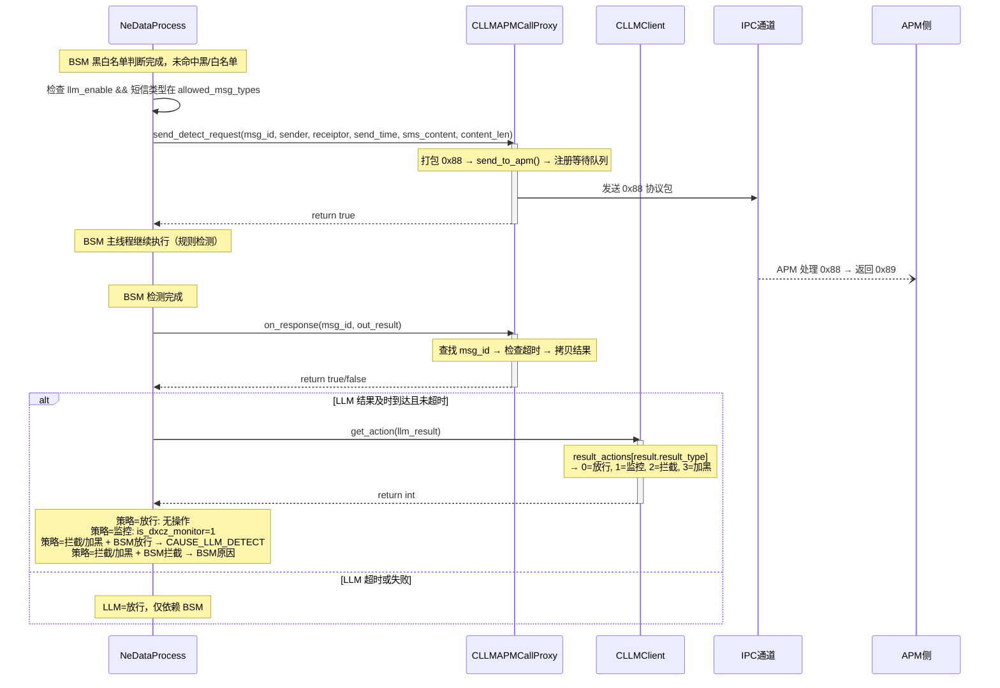
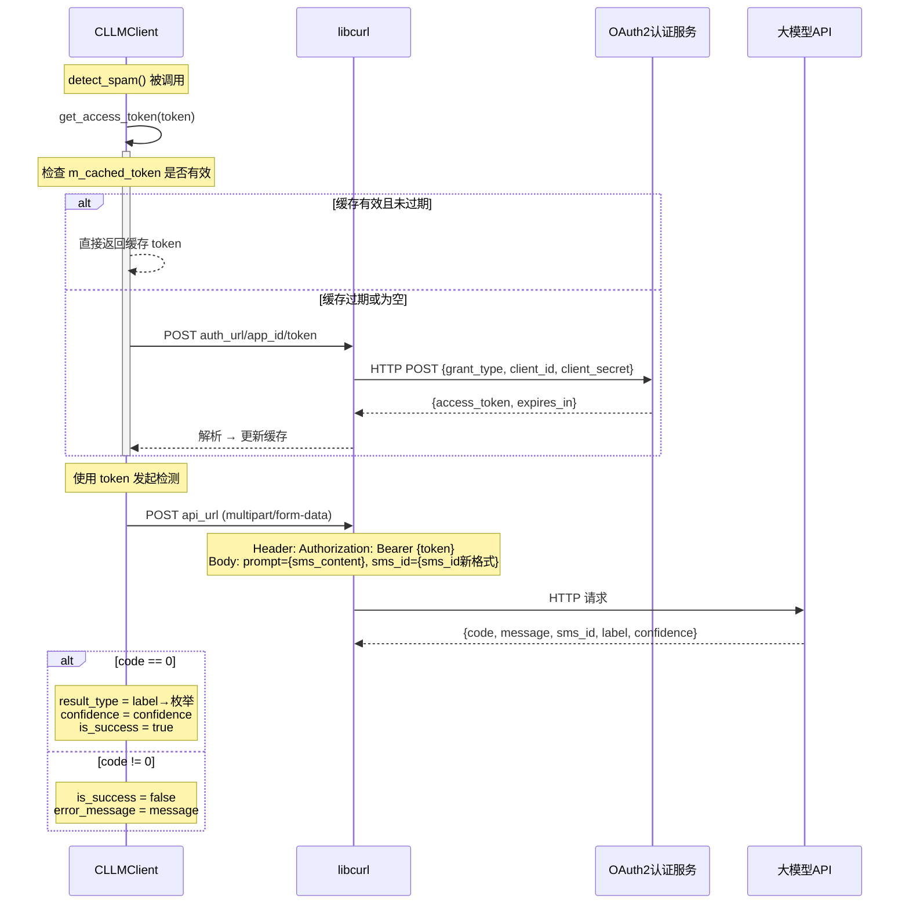
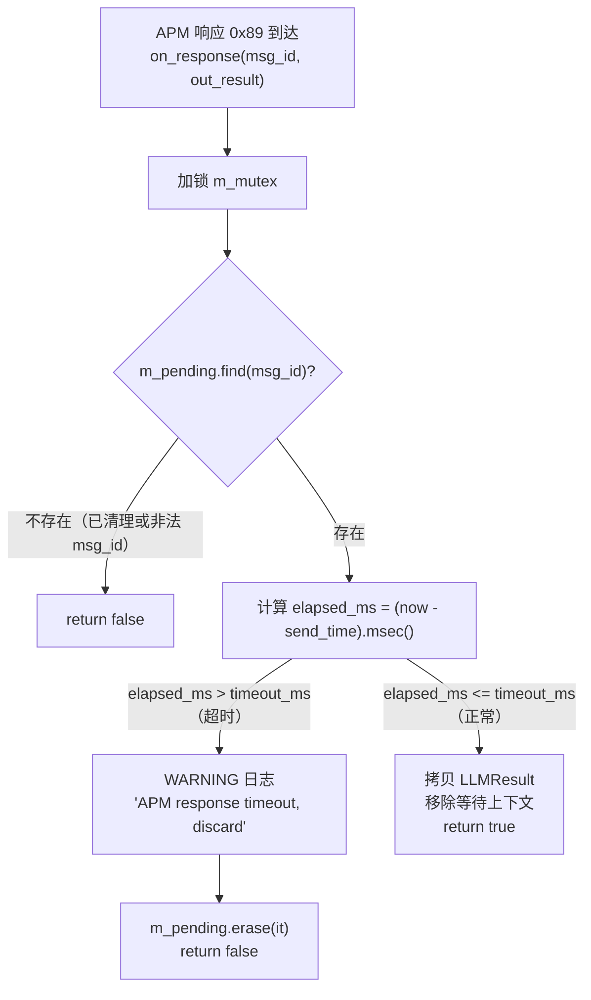

# 概要设计文档：元景 LLM 反诈模型集成

**版本:** v1.8
**日期:** 2026-05-09
**所属项目:** antispaming 2850

***

## 1. 概述

本文档基于《元景 LLM 反诈模型集成 PRD v1.5》进行概要设计，覆盖 LLM 检测功能的方案说明、配置组合、判定规则、模块划分、内部通信协议、调用流程、数据库设计。

***

## 2. 方案说明

### 2.1 方案一句话描述

在现有的 IPM黑白名单检测流程后，**需要BSM进行分析的内容，并行发送LLM 大模型检测**——支持两种部署模式：中转模式时 IPM 通过 IPC 发给 APM，APM 调用外部大模型 API；直连模式时 IPM 直接加载 libllmplugin 调用大模型 API。大模型返回内容分类（涉诈/涉黄/涉赌/广告/催收/正常/传销）后，按可配置策略执行放行、监控、拦截或加黑处置。

### 2.2 方案范围

| 包含                                                                 | 不包含            |
| ------------------------------------------------------------------ | -------------- |
| IPM ↔ APM 的 IPC 协议扩展（0x88/0x89 + 0x8A/0x8B）                        | 修改原有的 BSM 检测逻辑 |
| libllmplugin 公共库（流控+统计+日志+HTTP调用+本地IP绑定+新sms\_id格式）                | 修改原有的黑白名单判断    |
| APM 侧插件加载、大模型 API 调用                                               | 修改原有的拦截入库流程    |
| IPM 侧请求发送、超时控制、策略分发（加黑/拦截/监控/放行）                                   | 修改原有的统计上报流程    |
| 直连模式（call\_mode=0，IPM 本地加载 libllmplugin）                           | <br />         |
| 中转模式（call\_mode=1，IPM→APM→大模型 API）                                 | <br />         |
| 配置的数据库存储和动态加载                                                      | <br />         |
| DATA\_SM\_STOP 增加 LLM 分类字段（llm\_result\_type/confidence/triggered） | <br />         |
| 新建 DATA\_LLM\_MONITOR 监控表 + 查询页面                                   | <br />         |
| Oracle 升级脚本（含大表兼容策略）                                               | <br />         |

### 2.3 方案的各参与方

```
短信中心 → IPM（判断黑白名单 → 并行 BSM+LLM 检测 → 综合判定）→ 短信中心
                                    │
                            LLM 路径 (中转模式):
                            IPM → [IPC 0x88] → APM → [libllmplugin.so] → 大模型 API
                                  ← [IPC 0x89] ←                              ↑
                                                                       内置流控+统计+周期日志

                            LLM 路径 (直连模式):
                            IPM → [libllmplugin.so] → 大模型 API
                                       ↑
                                内置流控+统计+周期日志
```

### 2.4 方案的关键决策点

整个方案有 **3 个配置开关** 和 **3 个运行时结果** 决定最终行为：

**3 个配置开关：**

| #  | 开关                       | 可选值      | 作用                  |
| -- | ------------------------ | -------- | ------------------- |
| S1 | llm\_enable              | ON / OFF | LLM 检测功能总闸          |
| S2 | llm\_allowed\_msg\_types | 类型 ID 列表 | 哪些短信类型需要送 LLM 检测    |
| S3 | llm\_result\_actions     | 7 个策略编码  | 每个分类结果（0\~6）对应的处置策略 |

**3 个运行时结果：**

| #  | 结果                   | 可能值                  |
| -- | -------------------- | -------------------- |
| R1 | BSM 检测结果             | 拦截 / 放行              |
| R2 | LLM 检测结果（大模型 API 返回） | 正常/涉诈/涉黄/涉赌/广告/催收/传销 |
| R3 | LLM 调用状态             | 成功 / 超时 / 失败 / 限流    |

***

## 3. 配置组合与行为矩阵

### 3.1 llm\_enable 总开关

| llm\_enable | LLM 调用 | LLM 拦截 | 适用场景                  |
| :---------: | :----: | :----: | --------------------- |
|     OFF     |   不调用  |   不拦截  | LLM 服务异常时紧急关闭，完全走原有逻辑 |
|      ON     |  正常调用  |   按配置  | 正常生产运营                |

> llm\_enable=OFF 时，系统行为与未集成 LLM 前完全一致，0 性能损耗。

### 3.2 llm\_allowed\_msg\_types 检测范围

此配置控制「哪些短信类型会送 LLM 检测」。短信类型 ID 列表以逗号分隔存储，如 `1,6` 表示只对类型 1 和类型 6 的短信执行 LLM 检测。

| 短信类型是否在 allowed\_msg\_types 中 | LLM 是否检测 |
| :---------------------------: | :------: |
|               是               |    检测    |
|               否               |    不检测   |

### 3.3 llm\_result\_actions 分类处置策略

此配置控制「每个 LLM 分类结果（0\~6）对应的处置策略」。存储为逗号分隔 7 个策略编码，按分类枚举值 0\~6 顺序排列。

**策略编码：**

|  编码 |  策略 | 说明                               |
| :-: | :-: | -------------------------------- |
|  0  |  放行 | 不做处理，短信正常通过                      |
|  1  |  监控 | 仅记录监控入库，不下发拦截（复用 BSM 监控能力）       |
|  2  |  拦截 | 拦截该条短信                           |
|  3  |  加黑 | 将主叫号码加入黑名单 + 拦截该条短信（复用 IPM 加黑能力） |

**默认配置：** `"0,3,2,2,1,1,0"` 对应：

| 枚举值 | 分类标签 |  默认策略  |
| :-: | ---- | :----: |
|  0  | 正常   |   放行   |
|  1  | 涉诈   | **加黑** |
|  2  | 涉黄   |   拦截   |
|  3  | 涉赌   |   拦截   |
|  4  | 广告   |   监控   |
|  5  | 催收   |   监控   |
|  6  | 传销   |   放行   |

### 3.4 配置组合汇总表

| llm\_enable | 短信类型匹配 | LLM 调用 |           LLM 处置          | 最终行为              |
| :---------: | :----: | :----: | :-----------------------: | :---------------- |
|     OFF     |    -   |   不调用  |            无影响            | 仅根据 BSM 结果        |
|      ON     |   匹配   |   调用   | 按 llm\_result\_actions 执行 | BSM结果 + LLM策略综合判定 |
|      ON     |   不匹配  |   不调用  |            无影响            | 仅根据 BSM 结果        |

***

## 4. 判定决策表

### 4.1 最终结果判定

`最终结果 = f(BSM结果, LLM调用状态, LLM分类, llm_result_actions)`

**编号规则：**

- BSM 结果：A=放行, B=拦截
- LLM 调用状态：1=成功, 2=超时, 3=失败, 4=限流
- LLM 分类：0\~6 → 查 llm\_result\_actions 得到策略：P=放行(0), M=监控(1), I=拦截(2), B=加黑(3)

**完整判定表：**

|  #  | BSM |   LLM状态  | LLM分类 |   LLM策略   |  最终结果  |    stop\_reason    | 补充行为 |
| :-: | :-: | :------: | :---: | :-------: | :----: | :----------------: | ---- |
|  1  |  A  |   成功(1)  |   0   |   P(放行)   |   放行   |      NO\_STOP      | -    |
|  2  |  A  |   成功(1)  |   1   | B(**加黑**) | **拦截** | CAUSE\_LLM\_DETECT | 号码加黑 |
|  3  |  A  |   成功(1)  |   2   | I(**拦截**) | **拦截** | CAUSE\_LLM\_DETECT | -    |
|  4  |  A  |   成功(1)  |   3   | I(**拦截**) | **拦截** | CAUSE\_LLM\_DETECT | -    |
|  5  |  A  |   成功(1)  |   4   | M(**监控**) | **放行** |      NO\_STOP      | 监控入库 |
|  6  |  A  |   成功(1)  |   5   | M(**监控**) | **放行** |      NO\_STOP      | 监控入库 |
|  7  |  A  |   成功(1)  |   6   |   P(放行)   |   放行   |      NO\_STOP      | -    |
|  8  |  A  | 超时/失败/限流 |   -   |     -     |   放行   |      NO\_STOP      | -    |
|  9  |  B  |   成功(1)  |   0   |   P(放行)   | **拦截** |        BSM原因       | -    |
|  10 |  B  |   成功(1)  |   1   | B(**加黑**) | **拦截** |       BSM原因¹       | 号码加黑 |
|  11 |  B  |   成功(1)  |   2   | I(**拦截**) | **拦截** |       BSM原因¹       | -    |
|  12 |  B  |   成功(1)  |   4   | M(**监控**) | **拦截** |        BSM原因       | 监控入库 |
|  13 |  B  | 超时/失败/限流 |   -   |     -     | **拦截** |        BSM原因       | -    |

> ¹ 当 BSM 已判定拦截时，stop\_reason 保留 BSM 的原有原因（如 CAUSE\_BLACKLIST），即使 LLM 也是拦截/加黑，不覆盖。

### 4.2 判定规则总结

```
最终结果 = 拦截 当且仅当:
   BSM结果=拦截
   或 LLM策略 ∈ {拦截, 加黑}

号码加黑 当且仅当:
   LLM策略 = 加黑 (3)

监控入库 当且仅当:
   LLM策略 = 监控 (1)

stop_reason:
   BSM拦截 → BSM原有原因
   LLM加黑/拦截 + BSM放行 → CAUSE_LLM_DETECT
```

### 4.3 CAUSE\_LLM\_DETECT 触发条件



***

## 5. 整体架构

### 5.1 进程架构

#### 中转模式（call\_mode=1，默认）



#### 直连模式（call\_mode=0）



### 5.2 短信处理主流程（含 LLM 并行检测）



### 5.3 APM 内部 LLM 请求处理流程



### 5.4 设计原则

| 原则    | 说明                                                         |
| ----- | ---------------------------------------------------------- |
| 双模式部署 | 支持中转模式（IPM→APM→大模型API）和直连模式（IPM→大模型API）                    |
| 插件解耦  | 所有大模型逻辑收进 libllmplugin 动态库，IPM/APM 通过 dlopen 加载            |
| 流量控制  | libllmplugin 库内建令牌桶算法，每个进程独立限速，无需中心协调                      |
| 零侵入   | 不修改原有 BSM/APM 检测逻辑                                         |
| 线程安全  | token 缓存使用 mutex 保护，限流器线程安全                                |
| 失败容错  | LLM 任何失败默认放行，不阻塞核心短信通路                                     |
| 异步非阻塞 | send\_detect\_request() 立即返回，BSM 完成后通过 on\_response() 检查结果 |

***

## 6. 异常场景矩阵

### 6.1 LLM 检测各异常场景的处理

| 异常场景           | 触发条件                      |       LLM 结果      | 对短信影响     | 日志      |            告警            |
| :------------- | :------------------------ | :---------------: | :-------- | :------ | :----------------------: |
| IPC 发送失败       | APM 连接断开                  |         放行        | 无影响，走 BSM | ERROR   |             -            |
| APM 响应超时       | 超过 llm\_wait\_timeout\_ms |         放行        | 无影响，走 BSM | WARNING |             -            |
| APM 限流降级       | QPS 超过 llm\_max\_qps      | 放行（is\_success=2） | 无影响，走 BSM | INFO    |             -            |
| 大模型 API 超时     | 超过 llm\_timeout\_ms       | 放行（is\_success=1） | 无影响，走 BSM | WARNING | 连续5次触发 LLM\_API\_TIMEOUT |
| 大模型 API 返回非200 | HTTP 状态码错误                | 放行（is\_success=1） | 无影响，走 BSM | ERROR   |  连续5次触发 LLM\_API\_ERROR  |
| 大模型 API 返回错误码  | code != 0                 | 放行（is\_success=1） | 无影响，走 BSM | ERROR   |    归入 LLM\_API\_ERROR    |
| 认证失败（token）    | client\_id/secret 错误      | 放行（is\_success=1） | 无影响，走 BSM | ERROR   | 连续3次触发 LLM\_AUTH\_FAILED |
| 配置未加载          | 数据库字段为空                   |     LLM 检测不执行     | 无影响，走 BSM | INFO    |             -            |
| IPC 连接断开       | 网络分区                      |       等待队列清空      | 无影响，走 BSM | WARNING |             -            |

### 6.2 核心原则

**LLM 检测是增值能力，任何 LLM 失败都不影响核心短信通路，默认放行保证短信可达。**

***

## 7. 内部通信协议设计

### 7.1 现有协议框架

**复用现有通信链路：** IPM ↔ APM 内部通信

现有协议头定义（`CommunicationProtocol.h`，`MESSAGE_HEAD_SIZE = 16`）：

```cpp
struct message_header {
    ACE_INT32  message_id;   // 功能码/命令字（网络字节序）
    ACE_INT32  version;      // 协议版本
    ACE_INT32  length;       // 包体长度（网络字节序）
    ACE_INT32  sequence;     // 序列号（用于请求-响应匹配）
};
```

**现有 function\_id 参考值：**

| function\_id | 协议名称                   | 说明     |
| ------------ | ---------------------- | ------ |
| 0x01         | LOGIN\_REQ             | 登录请求   |
| 0x02         | LOGOUT\_REQ            | 注销请求   |
| 0x03         | LOGIN\_RESP            | 登录应答   |
| 0x10         | CONFIG\_CHANGE\_NOTIFY | 配置变更通知 |
| 0x80         | MESSAGE\_PROCESS\_REQ  | 消息处理请求 |
| 0x81         | MESSAGE\_PROCESS\_RESP | 消息处理应答 |

### 7.2 LLM 协议扩展

**扩展方式：** 新增 function\_id（0x88/0x89/0x8A/0x8B），复用现有消息头和通信链路

| 协议                     | function\_id | 方向        | 说明       |
| ---------------------- | ------------ | --------- | -------- |
| LLMDetectReq\_package  | 0x88         | IPM → APM | LLM 检测请求 |
| LLMDetectResp\_package | 0x89         | APM → IPM | LLM 检测响应 |
| LLMConfigUpdateReq     | 0x8A         | APM → IPM | LLM 配置广播 |
| LLMConfigUpdateResp    | 0x8B         | IPM → APM | 配置更新应答   |

**LLM 检测请求协议（IPM → APM）：**

```cpp
#ifdef _LINUX
#pragma pack(push,1)
#endif

struct llm_detect_req {
    ACE_INT64  msg_id;                     // 短信消息ID（用于匹配响应）
    char       sender_num[21];             // 主叫号码（不足补0）
    char       receiptor_num[21];          // 被叫号码（不足补0）
    ACE_INT64  send_time;                  // 发送时间
    ACE_INT16  sms_content_len;            // 短信内容长度，最大512
    // char sms_content[sms_content_len];   // 变长字段，紧跟在结构体后面
};

struct LLMDetectReq_package {
    message_header         pkg_header;      // function_id = 0x88
    llm_detect_req        pkg_body;
    // char sms_content[sms_content_len];  // 变长字段
};

#ifdef _LINUX
#pragma pack(pop)
#endif
```

**LLM 检测响应协议（APM → IPM）：**

```cpp
#ifdef _LINUX
#pragma pack(push,1)
#endif

struct llm_detect_resp {
    ACE_INT64  msg_id;                    // 短信消息ID（与请求对应）
    ACE_INT8   is_success;                // 检测是否成功：0=成功，1=失败，2=限流
    ACE_INT8   result_type;               // 分类结果：0~6
    float       confidence;               // 置信度
    ACE_INT16  error_msg_len;            // 错误信息长度，最大127
    // char error_msg[error_msg_len];      // 变长字段，检测失败时填写
};

struct LLMDetectResp_package {
    message_header        pkg_header;      // function_id = 0x89
    llm_detect_resp       pkg_body;
    // char error_msg[error_msg_len];      // 变长字段
};

#ifdef _LINUX
#pragma pack(pop)
#endif
```

**LLM 配置更新协议（APM → IPM，0x8A）：**

```cpp
#ifdef _LINUX
#pragma pack(push,1)
#endif

struct llm_config_update {
    ACE_INT8   enable;                    // 0=关闭, 1=开启
    ACE_INT8   call_mode;                 // 0=直连, 1=中转
    ACE_INT32  max_qps;                   // 每秒最大请求数
    char       api_url[256];              // 大模型检测API地址
    char       auth_url[256];             // OAuth2认证地址
    char       app_id[64];                // 应用ID
    char       client_id[64];             // 客户端ID
    char       client_secret[256];        // 客户端密钥
    char       access_token[512];         // 静态令牌
    ACE_INT32  timeout_ms;                // HTTP超时
    ACE_INT32  wait_timeout_ms;           // IPM等待超时
    ACE_INT32  retry_count;               // 重试次数
    char       allowed_msg_types[128];    // 允许检测的类型，逗号分隔
    char       result_actions[64];        // 7个分类的处置策略，逗号分隔
    char       local_bind_iface[64];      // 新增：本地网卡接口名（如 eth0）
};

#ifdef _LINUX
#pragma pack(pop)
#endif
```

### 7.3 响应 is\_success 字段说明

| is\_success | 含义                   | 后续处理                                     |
| :---------: | -------------------- | ---------------------------------------- |
|      0      | 检测成功，result\_type 有效 | 根据 result\_actions\[result\_type] 执行处置策略 |
|      1      | 检测失败（API 错误/超时/配置错误） | LLM=放行，仅依赖 BSM                           |
|      2      | 限流降级（APM 令牌不足）       | LLM=放行，仅依赖 BSM                           |

### 7.4 分类结果枚举

| 枚举值 | 常量名                     | 分类标签 | 说明           |
| :-: | ----------------------- | ---- | ------------ |
|  0  | LLM\_RESULT\_NORMAL     | 正常   | 正常短信，不拦截     |
|  1  | LLM\_RESULT\_FRAUD      | 涉诈   | 高危，需拦截       |
|  2  | LLM\_RESULT\_PORN       | 涉黄   | 违规内容，建议拦截    |
|  3  | LLM\_RESULT\_GAMBLING   | 涉赌   | 违规内容，建议拦截    |
|  4  | LLM\_RESULT\_AD         | 广告   | 商业广告，可根据策略决定 |
|  5  | LLM\_RESULT\_COLLECTION | 催收   | 催收短信，可根据策略决定 |
|  6  | LLM\_RESULT\_PYRAMID    | 传销   | 传销内容         |

### 7.5 协议打包/解包时序

本次新增两对 IPC 协议（IPM ↔ APM 之间）：

| 协议方向      | 功能码    | 名称       | 触发时机                                              |
| --------- | ------ | -------- | ------------------------------------------------- |
| IPM → APM | `0x88` | LLM 检测请求 | IPM 收到短信后，在中转模式下将短信内容发给 APM 请求 LLM 分类             |
| APM → IPM | `0x89` | LLM 检测应答 | APM 调用大模型 API 完成分类后，将结果返回 IPM                     |
| APM → IPM | `0x8A` | LLM 配置更新 | APM 配置变更后，将最新配置（含 local\_bind\_iface）同步给所有 IPM 节点 |
| IPM → APM | `0x8B` | 配置更新应答   | IPM 确认收到配置变更                                      |

#### 0x88 请求内容

IPM 发送给 APM 的检测请求，包含：

| 字段    | 说明                    |
| ----- | --------------------- |
| 消息 ID | IPM 分配的唯一标识，用于匹配请求和应答 |
| 主叫号码  | 发送方号码                 |
| 被叫号码  | 接收方号码                 |
| 发送时间  | 短信提交时间                |
| 短信内容  | 变长字段，待检测的短信正文         |

#### 0x89 应答内容

APM 返回给 IPM 的检测结果，包含：

| 字段    | 说明                                 |
| ----- | ---------------------------------- |
| 消息 ID | 与请求中的消息 ID 一致，用于匹配                 |
| 是否成功  | 0=检测成功，1=检测失败                      |
| 分类结果  | 0=正常、1=涉诈、2=涉黄、3=涉赌、4=广告、5=催收、6=传销 |
| 置信度   | 模型返回的置信度分数（0.0\~1.0）               |
| 错误消息  | 检测失败时的错误描述（仅失败时携带）                 |

#### 超时处理

- IPM 发送 0x88 请求后，**不阻塞等待**，立即继续处理 BSM 黑白名单检测
- IPM 内置超时计时器（默认 5 秒），超时未收到 0x89 应答则视为 LLM 检测超时，短信按 LLM 未启用处理（即仅依据 BSM 结果放行/拦截）
- APM 收到 0x88 后，调用 libllmplugin 的 `llm_plugin_detect()` 完成流控检查和 API 调用，组装 0x89 应答包返回

#### 配置同步流程（0x8A/0x8B）

- APM 配置变更时，通过 `CCltProxy::broadcast_llm_config()` 向所有连接的 IPM 广播 0x8A 报文（含 local\_bind\_iface）
- IPM 收到后更新本地 `SYS_CONFIG->m_llm_config`，并回复 0x8B 确认
- 配置同步内容包括：总开关、调用模式、API 地址、认证参数、允许的短信类型、分类处置策略、本地绑定接口名

***

## 8. 模块设计

### 8.1 模块总览

| 模块                    |   所在进程  | 文件名                                    | 职责                                                               |
| --------------------- | :-----: | -------------------------------------- | ---------------------------------------------------------------- |
| CLLMAPMCallProxy      |   IPM   | `01_IPM/src/llm/LLMAPMCallProxy.h/cpp` | IPC 发送请求、接收响应、协议打包解包、msg\_id 匹配、超时控制                             |
| CLLMClient            |   IPM   | `01_IPM/src/llm/LLMClient.h/cpp`       | 直连 HTTP 调用、access\_token 缓存管理、get\_action() 策略查询                 |
| LLMProtocol           | IPM+APM | `01_IPM/src/llm/LLMProtocol.h`         | 0x88/0x89 协议结构体定义、分类结果常量                                         |
| APMHandler            |   APM   | 扩展现有模块                                 | 识别 0x88 路由到 LLM 处理                                               |
| CLLMPluginLoader（IPM） |   IPM   | `01_IPM/src/llm/LLMPluginLoader.h/cpp` | dlopen 加载 libllmplugin.so（直连模式）                                  |
| LLMPluginLoader（APM）  |   APM   | `03_APM/src/llm/LLMPluginLoader.h/cpp` | dlopen 加载 libllmplugin.so（中转模式）                                  |
| libllmplugin          | IPM/APM | `libllmplugin/`                        | 公共库：令牌桶流控 + OAuth2 token 管理 + HTTP 调用大模型 API + 5 分钟统计日志 + 本地IP绑定 |

### 8.2 IPM 侧模块关系



### 8.3 流控设计（libllmplugin 内置）

**设计原则：** 流控逻辑收进 libllmplugin 公共库内，每个进程独立的令牌桶算法，无需中心协调。

**限流策略：**

| 配置项           | 类型  | 默认值 | 说明                     |
| ------------- | --- | --- | ---------------------- |
| llm\_max\_qps | int | 500 | 每秒最大 LLM 检测请求数，0 表示不限流 |

**令牌桶实现要点：**

`llm_plugin_init()`/`llm_plugin_update_config()` 接收 `max_qps` 参数，初始化/重置令牌桶

每次 `llm_plugin_detect()` 调用时锁内做限流检查：

基于 `steady_clock` 计算时间差，按比例补充令牌

不足 1 个令牌时立即返回 `LLM_RATE_LIMITED (-2)`

- 令牌充足时锁内快照配置，释放锁，执行 HTTP 调用
- HTTP 完成后重新加锁更新统计计数
- 返回 `LLM_RATE_LIMITED` 时，调用方（APM 的 CltSocketSpm / IPM 的 NeDataProcess）以 `is_success=1` 返回，表示检测不可用、放行

**统计计数器（库内维护）：**

| 计数器                     | 类型            | 说明            |
| ----------------------- | ------------- | ------------- |
| s\_total\_count         | uint64\_t     | 总检测请求数        |
| s\_rate\_limited\_count | uint64\_t     | 被限流拒绝的请求数     |
| s\_failed\_count        | uint64\_t     | HTTP 调用失败的请求数 |
| s\_result\_counts\[7]   | uint64\_t\[7] | 各分类结果计数（0\~6） |

**周期日志输出：**

- 每隔 5 分钟通过回调输出一次统计信息，格式：
  `[LLM Perf] total=X, rate_limited=Y, failed=Z, results=[a,b,c,d,e,f,g]`

### 8.4 插件接口设计

```cpp
// LLMPlugin.h - 纯C接口，保证跨语言调用

// 返回码
#define LLM_OK               0   // 成功
#define LLM_ERR             -1   // 通用错误（网络/解析等）
#define LLM_RATE_LIMITED    -2   // 流控拒绝

// 日志级别
#define LLM_LOG_ERROR       1
#define LLM_LOG_WARN        2
#define LLM_LOG_INFO        3
#define LLM_LOG_DEBUG       4

// 日志回调类型 — 库通过此回调输出日志
typedef void (*llm_log_fn)(int level, const char* msg);

#ifdef __cplusplus
extern "C" {
#endif

// 初始化：10 参数，含 max_qps 流控 + local_bind_iface 本地IP绑定
int llm_plugin_init(const char* api_url, const char* auth_url,
                     const char* app_id, const char* client_id,
                     const char* client_secret, const char* access_token,
                     int timeout_ms, int retry_count,
                     int max_qps, const char* local_bind_iface);

// 热更新配置（同 10 参数）
int llm_plugin_update_config(const char* api_url, const char* auth_url,
                              const char* app_id, const char* client_id,
                              const char* client_secret, const char* access_token,
                              int timeout_ms, int retry_count,
                              int max_qps, const char* local_bind_iface);

// 执行检测，返回 LLM_OK / LLM_ERR / LLM_RATE_LIMITED
int llm_plugin_detect(const char* sms_content,
                       const char* sms_id,
                       const char* access_token,
                       int* result_type, float* confidence);

// 注册日志回调（NULL 则取消注册，回退到 stderr）
void llm_plugin_set_log_fn(llm_log_fn callback);

// 释放所有资源
void llm_plugin_cleanup();

#ifdef __cplusplus
}
#endif
```

**接口说明：**

| 函数                          | 职责                               | 实现要点                                               |
| --------------------------- | -------------------------------- | -------------------------------------------------- |
| llm\_plugin\_init           | 初始化 curl 全局、令牌桶、统计计数器            | 只执行一次，注册日志回调，设置 CURLOPT\_INTERFACE                 |
| llm\_plugin\_update\_config | 热更新配置，重置令牌桶                      | 动态调整 max\_qps，更新 local\_bind\_iface                |
| llm\_plugin\_detect         | 锁内限流检查 → 配置快照 → HTTP 调用 → 锁内更新统计 | 返回 LLM\_OK/LLM\_ERR/LLM\_RATE\_LIMITED；构造请求时绑定本地接口 |
| llm\_plugin\_set\_log\_fn   | 注册/注销日志回调                        | 调用方（APM/IPM）注册其 LOGGER\_FACTORY 包装器                |
| llm\_plugin\_cleanup        | 释放 curl 资源、重置所有计数器               | 进程退出或插件卸载时调用                                       |

**本地IP绑定实现：** llm\_plugin\_detect() 中构造 curl 句柄后、发起请求前执行：

```cpp
if (!cfg.local_bind_iface.empty()) {
    curl_easy_setopt(curl, CURLOPT_INTERFACE, cfg.local_bind_iface.c_str());
}
```

`CURLOPT_INTERFACE` 支持以下格式：

- 接口名：`"eth0"`、`"bond0"` — 自动获取该接口 IP
- IP 地址：`"192.168.1.100"` — 直接绑定该 IP
- 主机名：`"hostname"` — 解析后绑定

**两种绑定生效模式：**

| 模式                    | HTTP 发起方 | 绑定生效方         | 配置读取                            |
| --------------------- | -------- | ------------- | ------------------------------- |
| Relay (call\_mode=1)  | APM      | APM 的 curl 句柄 | APM 从 SYS\_LLM\_CONFIG 读取       |
| Direct (call\_mode=0) | IPM      | IPM 的 curl 句柄 | IPM 从 SYS\_LLM\_CONFIG 读取（广播下发） |

***

## 9. 调用流程

### 9.1 NeDataProcess 中 LLM 检测完整时序



### 9.2 sms\_id 格式（R2）

**当前：** `std::to_string(msg_id)` — 仅包含 msg\_id（即 ne\_list\_id），可追溯性不足。

**新格式：** `{sender}_{ne_list_id}_{sm_id}`

| 字段           | 来源                                         | 示例            |
| ------------ | ------------------------------------------ | ------------- |
| `sender`     | msg\_attribute\_pkg.msg\_body.sender       | `13800138000` |
| `ne_list_id` | msg\_attribute\_pkg.msg\_body.ne\_list\_id | `12345`       |
| `sm_id`      | msg\_attribute\_pkg.msg\_body.sm\_id       | `67890`       |

完整示例：`13800138000_12345_67890`

**注意：**

- `msg_id`（协议中的 ACE\_INT64 标识）保持不变，用于匹配 request/response
- 仅 HTTP 请求中 `sms_id` 字段使用新格式

### 9.3 CLLMClient::get\_action() 策略分发逻辑

```mermaid
flowchart TD
    IN["get_action(result)"] --> CHECK_SUCCESS{"result.is_success?"}

    CHECK_SUCCESS -->|false| RETURN0["return LLM_ACTION_PASS (0)<br/>(检测失败，放行)"]

    CHECK_SUCCESS -->|true| LOOKUP["result_actions[result.result_type]"]

    LOOKUP --> DISPATCH{"action?"}

    DISPATCH -->|PASS (0)| NOP["放行: 无操作"]
    DISPATCH -->|MONITOR (1)| MON["监控: is_dxcz_monitor = 1"]
    DISPATCH -->|BLOCK (2)| BLK["拦截: auth=BLACK, llm_triggered_block=true"]
    DISPATCH -->|BLACKLIST (3)| BLL["加黑: auth=BLACK, llm_triggered_block=true"]
```

### 9.4 CLLMClient 直连 HTTP 调用（备用路径）



### 9.5 超时机制

**超时配置：**

| 配置项                    | 类型  | 默认值  | 说明                                     |
| ---------------------- | --- | ---- | -------------------------------------- |
| llm\_wait\_timeout\_ms | int | 5000 | IPM 侧 CLLMAPMCallProxy 等待 APM 响应超时（毫秒） |

**超时处理流程（代码** **`LLMAPMCallProxy.cpp:103-129`）：**



***

## 10. 数据库设计

### 10.1 SYS\_LLM\_CONFIG 表结构（新增）

LLM 所有配置统一存储在专用表 `SYS_LLM_CONFIG` 中，与原有业务配置解耦。该表只有一条记录（单行配置），适配 IPM 集群部署模式，集群所有节点启动时加载同一行配置。

```sql
CREATE TABLE SYS_LLM_CONFIG (
    id                  NUMBER(1)       PRIMARY KEY CHECK (id = 1),   -- 锁单行

    -------- 基础开关 --------
    llm_enable          NUMBER(1)       DEFAULT 0 NOT NULL
                        CHECK (llm_enable IN (0,1)),                  -- 0=关闭, 1=开启

    -------- 架构与流控 --------
    llm_call_mode       NUMBER(1)       DEFAULT 1 NOT NULL
                        CHECK (llm_call_mode IN (0,1)),               -- 0=直连, 1=APM中转
    llm_max_qps         NUMBER(6)       DEFAULT 500 NOT NULL
                        CHECK (llm_max_qps >= 0),                     -- 0=不限流, 建议 1~10000
    llm_retry_count     NUMBER(2)       DEFAULT 2 NOT NULL
                        CHECK (llm_retry_count BETWEEN 0 AND 10),     -- 0=不重试
    llm_timeout_ms      NUMBER(6)       DEFAULT 30000 NOT NULL
                        CHECK (llm_timeout_ms BETWEEN 1000 AND 120000),  -- 1秒~2分钟
    llm_wait_timeout_ms NUMBER(6)       DEFAULT 5000 NOT NULL
                        CHECK (llm_wait_timeout_ms BETWEEN 1000 AND 60000), -- 1秒~1分钟

    -------- 接口地址 --------
    llm_api_url         VARCHAR2(256)   NOT NULL,                     -- 必填, http(s)://开头
    llm_auth_url        VARCHAR2(256)   NOT NULL,                     -- 必填, OAuth2认证服务地址, http(s)://开头
    llm_app_id          VARCHAR2(64)    NOT NULL,                     -- 元景平台分配
    llm_client_id       VARCHAR2(64)    NOT NULL,                     -- OAuth2 客户端ID
    llm_client_secret   VARCHAR2(256)   NOT NULL,                     -- cryptAES加密存储(hex)
    llm_access_token    VARCHAR2(512),                                -- 废弃: auth_url必填后不再需要

    -------- 检测范围 --------
    llm_allowed_msg_types VARCHAR2(128),                              -- 逗号分隔, 如 "1,2"
                                                                      -- 枚举值见表 短信类型复选框枚举

    -------- 处置策略 --------
    llm_result_actions  VARCHAR2(128)   DEFAULT '0,3,2,2,1,1,0',     -- 7个值逗号分隔
                                                                      -- 每个值 0=放行/1=监控/2=拦截/3=加黑
                                                                      -- 顺序对应分类枚举值 0~6

    -------- 本地IP绑定（R1 新增） --------
    llm_local_bind_iface VARCHAR2(64),                                -- 出访LLM API时绑定的本地网卡接口名
                                                                      -- 如 eth0, bond0, bond0:1, eth0.10

    -------- 审计字段 --------
    create_time         DATE            DEFAULT SYSDATE,
    update_time         DATE            DEFAULT SYSDATE,
    update_user         VARCHAR2(32)
);

COMMENT ON TABLE  SYS_LLM_CONFIG IS '大模型反诈检测参数配置';
COMMENT ON COLUMN SYS_LLM_CONFIG.llm_enable             IS '功能总开关 0=关闭 1=开启';
COMMENT ON COLUMN SYS_LLM_CONFIG.llm_call_mode           IS '调用架构 0=直连 1=APM中转';
COMMENT ON COLUMN SYS_LLM_CONFIG.llm_max_qps             IS '每秒最大检测请求数 0=不限流';
COMMENT ON COLUMN SYS_LLM_CONFIG.llm_retry_count         IS '失败重试次数 0~10';
COMMENT ON COLUMN SYS_LLM_CONFIG.llm_timeout_ms          IS 'APM侧HTTP调用超时 1000~120000ms';
COMMENT ON COLUMN SYS_LLM_CONFIG.llm_wait_timeout_ms     IS 'IPM侧等待APM响应超时 1000~60000ms';
COMMENT ON COLUMN SYS_LLM_CONFIG.llm_api_url             IS '大模型检测API地址 http(s)://';
COMMENT ON COLUMN SYS_LLM_CONFIG.llm_auth_url            IS 'OAuth2认证服务地址 必填 http(s)://';
COMMENT ON COLUMN SYS_LLM_CONFIG.llm_app_id              IS '元景平台应用ID';
COMMENT ON COLUMN SYS_LLM_CONFIG.llm_client_id           IS 'OAuth2客户端ID';
COMMENT ON COLUMN SYS_LLM_CONFIG.llm_client_secret       IS '客户端密钥 cryptAES加密存储(hex)';
COMMENT ON COLUMN SYS_LLM_CONFIG.llm_access_token        IS '静态访问令牌 已废弃';
COMMENT ON COLUMN SYS_LLM_CONFIG.llm_allowed_msg_types   IS '允许检测的短信业务类型ID列表 逗号分隔 枚举值1~6';
COMMENT ON COLUMN SYS_LLM_CONFIG.llm_result_actions      IS '分类处置策略 7个值逗号分隔 0放行1监控2拦截3加黑';
COMMENT ON COLUMN SYS_LLM_CONFIG.llm_local_bind_iface    IS '出访LLM API时绑定的本地网卡接口名 如 eth0 bond0';
```

> URL 格式校验规则见 [11.3 界面设计 → URL 输入校验规则](#)，前端保存时实时校验。

#### UI 校验规则速查

| 字段                      | 前端控件       | 取值范围/格式                                       |  必填 |      默认值      |
| ----------------------- | ---------- | --------------------------------------------- | :-: | :-----------: |
| `llm_enable`            | 复选框        | true/false                                    |  -  |     false     |
| `llm_call_mode`         | 单选框        | 0=直连, 1=APM中转                                 |  是  |       1       |
| `llm_max_qps`           | 数字输入框      | 0\~999999, 0=不限流                              |  是  |      500      |
| `llm_retry_count`       | 数字输入框      | 0\~10                                         |  是  |       2       |
| `llm_timeout_ms`        | 数字输入框      | 1000\~120000                                  |  是  |     30000     |
| `llm_wait_timeout_ms`   | 数字输入框      | 1000\~60000                                   |  是  |      5000     |
| `llm_api_url`           | 文本框        | 合法URL: http(s)://host\[:port]\[/path], ≤256字符 |  是  |       -       |
| `llm_auth_url`          | 文本框        | 合法URL: http(s)://host\[:port]\[/path], ≤256字符 |  是  |       -       |
| `llm_app_id`            | 文本框        | 长度≤64                                         |  是  |       -       |
| `llm_client_id`         | 文本框        | 长度≤64                                         |  是  |       -       |
| `llm_client_secret`     | 密码框(带显示切换) | 长度≤256, 提交为空则保留原值                             |  是  |       -       |
| `llm_access_token`      | -          | 已废弃                                           |  -  |       -       |
| `llm_allowed_msg_types` | 复选框组       | 枚举值{1,2,3,4,5,6}, 至少选1项                       |  是  |       -       |
| `llm_result_actions`    | 7个下拉框      | 每项{0=放行,1=监控,2=拦截,3=加黑}                       |  是  | 0,3,2,2,1,1,0 |
| `llm_local_bind_iface`  | 文本框        | 长度≤64, 网卡接口名                                  |  否  |       -       |

### 10.2 DB 加载 SQL

```sql
select llm_enable, llm_api_url, llm_auth_url, llm_app_id, llm_client_id,
       llm_client_secret, llm_timeout_ms, llm_retry_count,
       llm_allowed_msg_types, llm_result_actions, llm_call_mode, llm_max_qps,
       llm_wait_timeout_ms, llm_local_bind_iface
from SYS_LLM_CONFIG
```

### 10.3 llm\_client\_secret 加密存储方案

`llm_client_secret` 属于系统安全红线管控的敏感字段，必须加密存储。复用现有系统级 `cryptAES` 加密库（v1.2.0），与 DB 密码等字段保持一致。

**依赖：**

| 项目  | 说明                                                      |
| --- | ------------------------------------------------------- |
| 库名  | `cryptAES` v1.2.0                                       |
| 头文件 | `cryptAES/CryptOpenSSL.h`                               |
| 链接  | `-lcryptAES` (Makefile 已配置)                             |
| 路径  | `${ANTISPAM_PUB_LIB_ROOT}11_cryptAES/1.2.0/usr/include` |

**加密入库流程（配置保存时）：**

```
管理员输入明文 → AESEncrypt() → 二进制密文 → BufToHexString() → hex字符串 → 写入DB
```

**解密加载流程（模块启动/热加载时）：**

```
DB读取hex字符串 → HexStringToBuf() → 二进制密文 → AESDecrypt() → 明文 → LLMConfig.client_secret
```

**数据流总结：**

```
[界面输入明文] → [后端 AESEncrypt → hex] → [DB存储(cryptAES密文hex)]
                                                      │
[libllmplugin ← 明文] ← [AESDecrypt ← 二进制] ← [HexStringToBuf] ← [DB读取]
```

**代码落地位置：**

| 环节 | 文件                                            | 说明                                                       |
| -- | --------------------------------------------- | -------------------------------------------------------- |
| 加密 | `SystemConfigDBLoader.cpp` (IPM/APM)          | 保存配置时调用 `AESEncrypt()` + `BufToHexString()`              |
| 解密 | `SystemConfigDBLoader.cpp` (IPM/APM)          | 加载配置时调用 `HexStringToBuf()` + `AESDecrypt()`              |
| 传递 | `LLMPluginLoader.cpp` / `LLMAPMCallProxy.cpp` | 将解密后的明文传给 `llm_plugin_init` / `llm_plugin_update_config` |

> `LLMConfig.client_secret` 内存中始终存放**解密后的明文**，传给 libllmplugin 的 `client_secret` 参数也是明文，库内直接用于 OAuth2 认证。加密/解密仅在 DB 边界发生。

### 10.4 DATA\_SM\_STOP 增加 LLM 字段（R5）

**表名：** `DATA_SM_STOP`（antispam 库）

**新增字段：**

| 字段                | 类型          | 默认值  | 说明                                          |
| ----------------- | ----------- | ---- | ------------------------------------------- |
| `llm_result_type` | NUMBER(2)   | NULL | LLM 识别分类：0=正常,1=涉诈,2=涉黄,3=涉赌,4=广告,5=催收,6=传销 |
| `llm_confidence`  | NUMBER(5,4) | NULL | 置信度，如 0.9500                                |
| `llm_triggered`   | NUMBER(1)   | NULL | 0=BSM 触发拦截 1=LLM 触发拦截                       |

**后端代码改动：**

- **`InformationStopStorage.cpp`** — bind\_parameter() 增加 3 个字段的 INSERT 绑定
- **`ModulePublicDefine.h`** — stop\_msg 结构体增加字段：

```cpp
ACE_INT8   llm_result_type;   // LLM 分类结果
float      llm_confidence;    // 置信度
ACE_INT8   llm_triggered;     // 是否 LLM 触发拦截
```

- **`NeDataProcess.cpp`** — `insert_stoppedmsg_into_db()` 或 `build_structure_of_stopped_msg()` 中填入 LLM 结果：

```cpp
stop_msg->llm_result_type = llm_result.result_type;
stop_msg->llm_confidence  = llm_result.confidence;
stop_msg->llm_triggered   = (stop_reason == CAUSE_LLM_DETECT) ? 1 : 0;
```

**LLM 检测结果传递：** 检测结果在 LLM 检测块中产生（约 680-760 行），需将 `result_type`、`confidence`、`is_llm_triggered` 三个值传递到 `insert_stoppedmsg_into_db()`。建议在 `TSMAttributePackage` 或 `stop_msg_attrib` 中增加临时字段暂存。

### 10.5 新建监控表 DATA\_LLM\_MONITOR（R5）

**表名：** `DATA_LLM_MONITOR`（antispam 库）

```sql
CREATE TABLE DATA_LLM_MONITOR (
    list_id         NUMBER(18)    NOT NULL,
    sms_id          VARCHAR2(128)  NOT NULL,   -- sms_id（新格式：sender_ne_list_id_sm_id）
    sender          VARCHAR2(22),              -- 主叫号码
    receiptor       VARCHAR2(22),              -- 被叫号码
    sm_content      VARCHAR2(4000),            -- 短信内容
    send_time       DATE,                       -- 短信发送时间
    llm_result_type NUMBER(2),                 -- LLM 分类结果
    llm_confidence  NUMBER(5,4),               -- 置信度
    detect_time     DATE          NOT NULL,     -- LLM 检测时间
    sync_id         NUMBER(18)    NOT NULL      -- 同步 ID
)
TABLESPACE ASTBLSP_2
PARTITION BY RANGE (detect_time)
INTERVAL (NUMTODSINTERVAL(1, 'DAY'))
(
    PARTITION P0 VALUES LESS THAN (TO_DATE('2026-01-01', 'YYYY-MM-DD'))
)
NOCACHE;
```

**后端新增文件：**

| 文件                                                          | 职责          |
| ----------------------------------------------------------- | ----------- |
| `01_IPM/src/dbinteraction/InformationLLMMonitorStorage.h`   | 声明          |
| `01_IPM/src/dbinteraction/InformationLLMMonitorStorage.cpp` | INSERT 绑定实现 |
| `01_IPM/src/datasave/DataCashe` 增加队列和回调                     | 异步写入        |

**写入时机：** NeDataProcess.cpp 中 LLM 检测块，当 `action == LLM_ACTION_MONITOR` 时：

```cpp
if (action == LLM_ACTION_MONITOR) {
    DATA_CASHE->llm_monitor_push(list_id, sms_id, sender, receiptor,
                                  sm_content, send_time, result_type,
                                  confidence);
}
```

### 10.6 数据流总图（R5）

```
短信到达 → IPM NeDataProcess
    │
    ├─ LLM 检测
    │    ├─ action=PASS    → 无 DB 写入
    │    ├─ action=MONITOR → 写入 DATA_LLM_MONITOR（新表）
    │    │                    + 通过现有 DXCZ 通道上报外部
    │    ├─ action=BLOCK   → 写入 DATA_SM_STOP（含新增3个字段）
    │    └─ action=BLACKLIST → BLOCK + 个人黑名单持久化
```

### 10.7 告警配置

LLM 告警复用现有告警体系，新增以下告警项：

| 告警ID              | 告警描述         | 触发条件                |  级别 | 处理建议               |
| ----------------- | ------------ | ------------------- | :-: | ------------------ |
| LLM\_AUTH\_FAILED | LLM认证连续失败    | 连续3次获取token失败       |  重要 | 检查credentials配置和网络 |
| LLM\_API\_TIMEOUT | LLM检测API连续超时 | 连续5次检测超时            |  警告 | 检查网络和API服务状态       |
| LLM\_API\_ERROR   | LLM检测API连续错误 | 连续5次非200或error code |  警告 | 检查API地址和服务状态       |

***

## 11. 配置项

### 11.1 完整配置清单

| 配置项                      | 类型     |       默认值       | 存储位置 | 说明                                       |
| ------------------------ | ------ | :-------------: | ---- | ---------------------------------------- |
| llm\_enable              | bool   |      false      | DB   | 功能总开关                                    |
| llm\_call\_mode          | int    |        1        | DB   | 0=直连, 1=APM中转                            |
| llm\_max\_qps            | int    |       500       | DB   | 每秒最大请求数                                  |
| llm\_retry\_count        | int    |        2        | DB   | 失败重试次数                                   |
| llm\_api\_url            | string |        -        | DB   | 大模型检测 API 地址                             |
| llm\_auth\_url           | string |        -        | DB   | OAuth2 认证地址                              |
| llm\_app\_id             | string |        -        | DB   | 应用 ID                                    |
| llm\_client\_id          | string |        -        | DB   | 客户端 ID                                   |
| llm\_client\_secret      | string |        -        | DB   | 客户端密钥（cryptAES加密存储，hex格式）                |
| llm\_access\_token       | string |        -        | DB   | ~~静态令牌~~（废弃: auth\_url必填后不再需要）           |
| llm\_timeout\_ms         | int    |      30000      | DB   | APM侧超时（毫秒）                               |
| llm\_wait\_timeout\_ms   | int    |       5000      | DB   | IPM侧等待超时（毫秒）                             |
| llm\_allowed\_msg\_types | string |        -        | DB   | 检测的短信类型，逗号分隔                             |
| llm\_result\_actions     | string | `0,3,2,2,1,1,0` | DB   | 7个分类0\~6的处置策略编码，逗号分隔。0=放行,1=监控,2=拦截,3=加黑 |
| llm\_local\_bind\_iface  | string |        -        | DB   | 本地网卡接口名（R1 新增），如 eth0、bond0              |

### 11.2 动态生效项

| 配置项                     | 生效方式   | 实现位置                                                                             |
| ----------------------- | ------ | -------------------------------------------------------------------------------- |
| llm\_enable             | 实时     | CLLMAPMCallProxy / CLLMPluginLoader（按 call\_mode）                                |
| llm\_result\_actions    | 实时     | NeDataProcess 按策略执行（加黑/拦截/监控/放行）                                                 |
| llm\_call\_mode         | 实时     | NeDataProcess 路径分支选择                                                             |
| llm\_max\_qps           | 实时     | APM: LLMPluginLoader::update\_plugin\_config() → libllmplugin 重置令牌桶              |
| llm\_wait\_timeout\_ms  | 实时     | CLLMAPMCallProxy 等待队列                                                            |
| llm\_result\_actions    | 实时     | NeDataProcess 策略分发 + CLLMClient::get\_action()                                   |
| llm\_local\_bind\_iface | 实时     | APM: LLMPluginLoader::update\_plugin\_config() → libllmplugin CURLOPT\_INTERFACE |
| <br />                  | <br /> | IPM: CLLMPluginLoader::update\_plugin\_config() → libllmplugin（直连模式）             |

### 11.3 界面设计：大联通大模型接口参数配置

**菜单位置:** 接口管理 → 大联通大模型接口参数配置

**页面布局（分栏卡片式，5 个配置区）：**

```
┌─ 基础开关 ────────────────────────────────────────┐
│  [✓] 启用大模型检测                                │
└────────────────────────────────────────────────────┘

┌─ 架构与流控 ──────────────────────────────────────┐
│  调用模式: (●) APM中转 (○) 直连                    │
│  max_qps: [ 500  ] QPS    重试: [ 2 ] 次           │
│  API超时: [30000] ms     等待超时: [5000] ms       │
└────────────────────────────────────────────────────┘

┌─ 接口地址 ────────────────────────────────────────┐
│  API地址:    [_________________]                   │
│  认证地址:   [_________________]  OAuth2 *必填     │
│  应用ID:     [_________________]                   │
│  客户端ID:   [_________________]                   │
│  客户端密钥: [••••••••••________] [显示]           │
│  本地绑定网卡: [eth0          ]  接口名如 eth0      │
└────────────────────────────────────────────────────┘

┌─ 检测范围 ────────────────────────────────────────┐
│  [✓] 点对点短信  [✓] SP短信  [ ] 行业短信  ...    │
└────────────────────────────────────────────────────┘

┌─ 处置策略 ────────────────────────────────────────┐
│  分类标签   枚举值  处置策略                       │
│  正常       0      [放行 ▼]                       │
│  涉诈       1      [加黑 ▼]                       │
│  涉黄       2      [拦截 ▼]                       │
│  涉赌       3      [拦截 ▼]                       │
│  广告       4      [监控 ▼]                       │
│  催收       5      [监控 ▼]                       │
│  传销       6      [放行 ▼]                       │
│  [全部设为监控] [全部设为放行] [恢复默认]          │
└────────────────────────────────────────────────────┘

                                        [保存配置]
```

#### 控件要素与约束

| #  | 分组    | 标签       | DB字段                    | 控件   |  必填 |   默认  | 约束                                             |
| -- | ----- | -------- | ----------------------- | ---- | :-: | :---: | ---------------------------------------------- |
| 1  | 基础开关  | 启用大模型检测  | `llm_enable`            | 复选框  |  -  | false | 关闭时整表单灰显                                       |
| 2  | 架构与流控 | 调用模式     | `llm_call_mode`         | 单选组  |  是  | 1(中转) | 0=直连,1=中转；切换弹确认框                               |
| 3  | 架构与流控 | max\_qps | `llm_max_qps`           | 数字框  |  是  |  500  | 1\~10000, 0=不限流                                |
| 4  | 架构与流控 | 重试次数     | `llm_retry_count`       | 数字框  |  是  |   2   | 0\~5                                           |
| 5  | 架构与流控 | API超时    | `llm_timeout_ms`        | 数字框  |  是  | 30000 | 1000\~60000 ms                                 |
| 6  | 架构与流控 | 等待超时     | `llm_wait_timeout_ms`   | 数字框  |  是  |  5000 | 1000\~30000 ms；直连模式灰显                          |
| 7  | 接口地址  | API地址    | `llm_api_url`           | 文本框  |  是  |   -   | 合法URL: http(s)://host\[:port]\[/path], max 256 |
| 8  | 接口地址  | 认证地址     | `llm_auth_url`          | 文本框  |  是  |   -   | 合法URL: http(s)://host\[:port]\[/path], max 256 |
| 9  | 接口地址  | 应用ID     | `llm_app_id`            | 文本框  |  是  |   -   | max 64                                         |
| 10 | 接口地址  | 客户端ID    | `llm_client_id`         | 文本框  |  是  |   -   | max 64                                         |
| 11 | 接口地址  | 客户端密钥    | `llm_client_secret`     | 密码框  |  是  |   -   | cryptAES加密存储(hex), 有\[显示]切换, max 256           |
| 12 | -     | ~~静态令牌~~ | `llm_access_token`      | -    |  -  |   -   | 已废弃                                            |
| 13 | 接口地址  | 本地绑定网卡   | `llm_local_bind_iface`  | 文本框  |  否  |   -   | 网卡接口名, max 64                                  |
| 14 | 检测范围  | 短信类型     | `llm_allowed_msg_types` | 复选框组 |  是  |   -   | 至少一项, 后端逗号分隔                                   |
| 15 | 处置策略  | 正常→策略    | `llm_result_actions[0]` | 下拉框  |  是  | 放行(0) | 选项: 放行/监控/拦截/加黑                                |
| 16 | 处置策略  | 涉诈→策略    | `llm_result_actions[1]` | 下拉框  |  是  | 加黑(3) | 选项: 放行/监控/拦截/加黑                                |
| 17 | 处置策略  | 涉黄→策略    | `llm_result_actions[2]` | 下拉框  |  是  | 拦截(2) | 选项: 放行/监控/拦截/加黑                                |
| 18 | 处置策略  | 涉赌→策略    | `llm_result_actions[3]` | 下拉框  |  是  | 拦截(2) | 选项: 放行/监控/拦截/加黑                                |
| 19 | 处置策略  | 广告→策略    | `llm_result_actions[4]` | 下拉框  |  是  | 监控(1) | 选项: 放行/监控/拦截/加黑                                |
| 20 | 处置策略  | 催收→策略    | `llm_result_actions[5]` | 下拉框  |  是  | 监控(1) | 选项: 放行/监控/拦截/加黑                                |
| 21 | 处置策略  | 传销→策略    | `llm_result_actions[6]` | 下拉框  |  是  | 放行(0) | 选项: 放行/监控/拦截/加黑                                |

#### URL 输入校验规则

> 管理员在界面上手工输入 `llm_api_url` 和 `llm_auth_url`，前端必须在保存前执行以下校验。校验未通过时红框标出对应字段并阻止提交。

**规则清单（前端实现）：**

| # | 规则                                                                   | 类型 | 不通过提示文案                    |
| - | -------------------------------------------------------------------- | -- | -------------------------- |
| 1 | 不能为空                                                                 | 必填 | `请输入API地址` / `请输入认证地址`     |
| 2 | 必须以 `http://` 或 `https://` 开头                                        | 格式 | `URL必须以http://或https://开头` |
| 3 | 协议后必须有主机（域名或IP），不能为空                                                 | 格式 | `URL缺少主机地址(IP或域名)`         |
| 4 | 总长度不超过 256 字符                                                        | 长度 | `URL长度不能超过256个字符`          |
| 5 | 仅允许合法URL字符：字母、数字、`.` `-` `_` `:` `/` `%` `?` `#` `[` `]` `@` `=` `&` | 字符 | `URL包含非法字符`                |
| 6 | 不能包含空格、中文、全角字符                                                       | 字符 | `URL不能包含空格或中文字符`           |

**正则参考（前端校验用）：**

```
^https?://[a-zA-Z0-9._\[\]@:%-]+(/[a-zA-Z0-9._\[\]@:%-]*)*(\?[a-zA-Z0-9._\[\]@:%=&-]*)?(#.*)?$
```

**两个 URL 的职责区分：**

| 字段             | 用途            | 使用方式                                               |
| -------------- | ------------- | -------------------------------------------------- |
| `llm_api_url`  | 短信反诈模型检测 API  | libllmplugin 原样使用，直接 POST                          |
| `llm_auth_url` | OAuth2 认证服务地址 | libllmplugin 拼接 `{auth_url}/{app_id}/token` 后 POST |

**合法输入示例：**

| URL                                                       | 是否合法 | 原因    |
| --------------------------------------------------------- | :--: | ----- |
| `http://137.4.20.194:5002/openapi/v1/antifraud/logs/test` |   ✓  | -     |
| `https://api.example.com/v1/oauth`                        |   ✓  | -     |
| `http://10.0.0.1`                                         |   ✓  | 无路径也可 |
| `https://137.4.20.44:5001`                                |   ✓  | 无路径也可 |
| `137.4.20.194:5002/api`                                   |   ✗  | 缺少协议头 |
| `http://`                                                 |   ✗  | 主机为空  |
| `http://api test.com/v1`                                  |   ✗  | 包含空格  |
| `https://中文域名.com/api`                                    |   ✗  | 包含中文  |

#### 短信类型复选框枚举

| 枚举值 | 标签（代码枚举 `EUserBussType`）   |   默认   |
| :-: | -------------------------- | :----: |
|  1  | 点对点 (`USER_BUS_P2P`)       |    ✓   |
|  2  | 梦网SP (`USER_BUS_SP`)       |    ✓   |
|  3  | 行业SP (`USER_BUS_SSP`)      | <br /> |
|  4  | 互联互通 (`USER_BUS_ITN`)      | <br /> |
|  5  | 自由业务 (`USER_BUS_FBS`)      | <br /> |
|  6  | 国际点对点 (`USER_INTERNATION`) | <br /> |

#### 处置策略选项表

|  策略 |  编码 | 含义              | 后端行为            |
| :-: | :-: | --------------- | --------------- |
|  放行 |  0  | 正常通过，不做处理       | 无操作             |
|  监控 |  1  | 仅记录监控入库，不下发拦截   | 复用 BSM 监控入库     |
|  拦截 |  2  | 拦截该条短信          | 现有 LLM block 逻辑 |
|  加黑 |  3  | 主叫号码加黑 + 拦截该条短信 | 复用 IPM 加黑接口     |

#### 联动规则

| 触发器                             | 联动行为                                                                                                        |
| ------------------------------- | ----------------------------------------------------------------------------------------------------------- |
| `llm_enable`=false              | 整个表单禁用，仅保留此开关可操作                                                                                            |
| `call_mode`=直连(0)               | 「等待超时」灰显，提示"直连模式无需此配置"                                                                                      |
| 保存时 `llm_enable`=true           | 逐项校验: api\_url/auth\_url 通过URL格式校验(见上方规则); app\_id/client\_id/client\_secret 必填; allowed\_msg\_types 至少勾选一项 |
| 保存时 `llm_enable`=false          | 仅保存开关状态，其余字段跳过校验                                                                                            |
| 保存前                             | 数字字段校验范围，密码字段为空时保留数据库原值; URL字段按规则清单逐条校验                                                                     |
| **保存成功且** **`call_mode`=中转(1)** | **弹窗提示"配置已保存，请重启 APM 及所有 IPM 节点使配置生效"**                                                                     |
| **保存成功且** **`call_mode`=直连(0)** | **弹窗提示"配置已保存，请重启所有 IPM 节点使配置生效"**                                                                           |

#### 保存行为说明

- 前端按联动规则做约束校验，未通过时红框标出错误字段并阻止提交
- `llm_api_url` / `llm_auth_url` 按「URL 输入校验规则」逐条校验，不合格的字段红框 + 提示文案
- 校验通过后提交到后端更新 `SYS_LLM_CONFIG` 表并触发热加载
- 保存成功后按 `call_mode` 弹出对应的重启提示（见联动规则表末两行）
- 密码字段 `llm_client_secret` 页面显示遮盖值，提交时若为空则表示不修改（保留数据库原值）

### 11.4 内存配置结构（SystemConfigCollection.h）

```cpp
struct LLMConfig {
    bool        enable;                    // 功能总开关
    int         call_mode;                 // 0=直连, 1=APM中转
    int         max_qps;                   // 每秒最大请求数
    int         retry_count;               // 失败重试次数
    string      api_url;                   // 大模型检测API地址
    string      auth_url;                  // OAuth2认证地址
    string      app_id;                    // 应用ID
    string      client_id;                 // 客户端ID
    string      client_secret;             // 客户端密钥（cryptAES解密后的明文）
    string      access_token;              // 静态令牌
    int         timeout_ms;                // APM侧超时
    int         wait_timeout_ms;           // IPM侧等待超时
    vector<int> allowed_msg_types;         // 允许检测的消息类型
    vector<int> result_actions;            // 7个分类0~6的处置策略编码
    string      local_bind_iface;          // 本地网卡接口名（R1 新增）

    LLMConfig()
        : enable(false), call_mode(1), max_qps(500), retry_count(2),
          timeout_ms(30000), wait_timeout_ms(5000) {
        // 默认: 0=放行,1=加黑,2=拦截,3=拦截,4=监控,5=监控,6=放行
        int default_actions[] = {0, 3, 2, 2, 1, 1, 0};
        result_actions.assign(default_actions, default_actions + 7);
    }
};
```

### 11.5 LLM 监控数据查询页面（R7）

**菜单位置：** 查询统计 → LLM 监控数据查询

#### 查询条件

| 条件      | 控件类型    | 说明                          |
| ------- | ------- | --------------------------- |
| 查询时间    | 日期范围选择器 | 必选，按 detect\_time 范围查询      |
| 主叫号码    | 文本输入框   | 模糊匹配 sender                 |
| 被叫号码    | 文本输入框   | 模糊匹配 receiptor              |
| LLM 分类  | 下拉多选    | 可选值：全部/正常/涉诈/涉黄/涉赌/广告/催收/传销 |
| sms\_id | 文本输入框   | 精确匹配                        |
| 短信内容    | 文本输入框   | 模糊匹配 sm\_content            |

#### 结果列表

| 列       | 说明                                      |
| ------- | --------------------------------------- |
| 检测时间    | detect\_time                            |
| sms\_id | 可追溯 ID（格式：sender\_ne\_list\_id\_sm\_id） |
| 主叫号码    | sender                                  |
| 被叫号码    | receiptor                               |
| 短信内容    | sm\_content（超出 50 字符截断加 "..."）          |
| 发送时间    | send\_time                              |
| 分类结果    | llm\_result\_type（显示中文标签）               |
| 置信度     | llm\_confidence（百分比显示）                  |

**分页：** 每页 20 行，支持翻页。

**详情弹出：** 点击某行弹出详情窗口，显示完整字段（sm\_content 全文）。

#### SQL 示例

```sql
SELECT * FROM DATA_LLM_MONITOR
 WHERE detect_time >= :start_time
   AND detect_time <  :end_time + 1
   AND (:sender IS NULL OR sender LIKE '%' || :sender || '%')
   AND (:receiptor IS NULL OR receiptor LIKE '%' || :receiptor || '%')
   AND (:result_type IS NULL OR llm_result_type = :result_type)
 ORDER BY detect_time DESC;
```

***

## 12. 文件清单

### 12.1 新增文件

| 文件路径                                                        | 说明                              |
| ----------------------------------------------------------- | ------------------------------- |
| `01_IPM/src/llm/LLMAPMCallProxy.h`                          | IPC 中转代理头文件                     |
| `01_IPM/src/llm/LLMAPMCallProxy.cpp`                        | IPC 中转代理实现                      |
| `01_IPM/src/llm/LLMProtocol.h`                              | 0x88/0x89 + 0x8A/0x8B 协议结构体定义   |
| `03_APM/src/llm/LLMProtocol.h`                              | 同上（APM 侧副本，与 IPM 侧一致）           |
| `01_IPM/src/llm/LLMPluginLoader.h`                          | IPM 插件加载器（直连模式）                 |
| `01_IPM/src/llm/LLMPluginLoader.cpp`                        | IPM 插件加载器实现 + 日志桥接 + 告警         |
| `03_APM/src/llm/LLMPluginLoader.h`                          | APM 插件加载器（中转模式）                 |
| `03_APM/src/llm/LLMPluginLoader.cpp`                        | APM 插件加载器实现 + 日志桥接 + 告警         |
| `libllmplugin/include/LLMPlugin.h`                          | 公共库插件接口（含返回码、日志级别、回调类型）         |
| `libllmplugin/src/LLMPlugin.cpp`                            | 公共库插件实现（含令牌桶流控 + 统计 + 5 分钟周期日志） |
| `01_IPM/src/dbinteraction/InformationLLMMonitorStorage.h`   | **新增 R5**：监控表写入声明               |
| `01_IPM/src/dbinteraction/InformationLLMMonitorStorage.cpp` | **新增 R5**：INSERT 绑定实现           |
| `docs/db/upgrade_v1.8.sql`                                  | **新增 R6**：Oracle DDL 升级脚本       |

### 12.2 修改文件

| 文件路径                                                  | 修改内容                                                                                                                                          |
| ----------------------------------------------------- | --------------------------------------------------------------------------------------------------------------------------------------------- |
| `01_IPM/src/ModulePublicDefine.h`                     | 新增 `CAUSE_LLM_DETECT = -37` 阻止原因枚举值；stop\_msg 结构体增加 llm\_result\_type/llm\_confidence/llm\_triggered（R5）                                      |
| `01_IPM/src/config/SystemConfigCollection.h`          | LLMConfig 新增 call\_mode/max\_qps/wait\_timeout\_ms/result\_actions/local\_bind\_iface（R1），移除 block\_enable/block\_result\_types               |
| `01_IPM/src/config/SystemConfigDBLoader.cpp`          | SQL 新增列 + 配置加载逻辑（result\_actions 逗号分隔解析 + llm\_local\_bind\_iface 加载）                                                                         |
| `01_IPM/src/config/SystemConfigFileLoader.cpp`        | ini 文件新增配置项读取（result\_actions 替换 block\_result\_types）                                                                                        |
| `01_IPM/src/comm/ApmHandle.cpp`                       | LLM\_CONFIG\_UPDATE\_REQ 处理：解析 result\_actions 字符串 + local\_bind\_iface 字段                                                                    |
| `01_IPM/src/process/NeDataProcess.cpp`                | LLM 并行检测 + call\_mode 分支（直连/中转）+ 策略分发（加黑/拦截/监控/放行）+ CAUSE\_LLM\_DETECT；sms\_id 新格式（R2）；监控写入 DATA\_LLM\_MONITOR（R5）；DATA\_SM\_STOP 写入新增3字段（R5） |
| `01_IPM/src/process/BusinessControl.cpp`              | 启动初始化/析构时加载/卸载插件（直连模式）                                                                                                                        |
| `01_IPM/src/llm/LLMClient.h/cpp`                      | 新增 `get_action()` 方法读取 result\_actions，`should_block()` 底层改用 result\_actions                                                                  |
| `01_IPM/src/llm/LLMProtocol.h`                        | result\_actions\[64] + local\_bind\_iface\[64] 替换 block\_enable + block\_result\_type\_count + block\_result\_types                           |
| `01_IPM/src/protocol/ProtocolFactory.h`               | 包含 LLMProtocol.h                                                                                                                              |
| `01_IPM/src/dbinteraction/InformationStopStorage.cpp` | **R5**：bind\_parameter 增加 llm\_result\_type/llm\_confidence/llm\_triggered 3 个字段绑定                                                            |
| `03_APM/src/SystemConfigCollection.h`                 | 同 IPM 侧，LLMConfig 新增 result\_actions/local\_bind\_iface、移除 block\_enable/block\_result\_types                                                 |
| `03_APM/src/SystemConfigDBLoader.cpp`                 | SQL 加载 result\_actions + llm\_local\_bind\_iface 替换 block\_result\_types                                                                      |
| `03_APM/src/ProtocolFactory.h`                        | 包含 LLMProtocol.h                                                                                                                              |
| `03_APM/src/llm/LLMPluginLoader.h/cpp`                | 更新函数指针为 10 参数（+max\_qps + local\_bind\_iface）、新增日志回调注册                                                                                        |
| `03_APM/src/CltSocketSpm.h/cpp`                       | 新增 `send_llm_config_update()` 打包 result\_actions + local\_bind\_iface 发送给 IPM；处理 LLM\_RATE\_LIMITED(-2)                                       |
| `03_APM/src/CltProxy.h/cpp`                           | 广播 LLM\_CONFIG\_UPDATE\_REQ 配置到所有 IPM 节点                                                                                                      |
| `03_APM/src/BusinessControl.cpp`                      | 删除 LLMFlowController、初始化时传递 max\_qps + local\_bind\_iface 给插件                                                                                 |
| `03_APM/src/llm/LLMFlowController.h/cpp`              | **删除** — 流控已移至 libllmplugin 内置                                                                                                                |
| `03_APM/src/llm/LLMProtocol.h`                        | result\_actions\[64] + local\_bind\_iface\[64] 替换旧 block 字段（同 IPM 侧）                                                                          |
| `libllmplugin/include/LLMPlugin.h`                    | 新增返回码/日志级别/日志回调 type/10 参数接口（+local\_bind\_iface）                                                                                             |
| `libllmplugin/src/LLMPlugin.cpp`                      | 新增令牌桶流控、统计计数器、5 分钟周期日志、CURLOPT\_INTERFACE 本地IP绑定（R1）                                                                                          |
| `libllmplugin/CMakeLists.txt`                         | 新增 ANTISPAM\_INC\_ROOT 可选 SDK 路径                                                                                                              |

***

## 13. 升级脚本（R6）

### 13.1 策略

现网 `DATA_SM_STOP` 表数据量大，采用以下策略：

1. **ADD 列时不指定 DEFAULT** — 避免 Oracle 对已有数据逐行写入默认值（产生大量 undo/redo）
2. **ALTER TABLE 仅加 NULLABLE 列** — 仅修改数据字典，秒级完成
3. **后续按需分批回填** — 使用 PL/SQL 批量 UPDATE（每批 10000 行）

### 13.2 升级 SQL

```sql
-- =============================================================
-- Upgrade Script: LLM Anti-Fraud Enhancement (R1-R7)
-- Database: Oracle
-- =============================================================

set serveroutput on

-- 1. SYS_LLM_CONFIG 增加本地绑定接口名字段
DECLARE
    v_count INTEGER;
BEGIN
    SELECT COUNT(*) INTO v_count
      FROM user_tab_columns
     WHERE table_name  = 'SYS_LLM_CONFIG'
       AND column_name = 'LLM_LOCAL_BIND_IFACE';
    IF v_count = 0 THEN
        EXECUTE IMMEDIATE 'ALTER TABLE SYS_LLM_CONFIG ADD llm_local_bind_iface VARCHAR2(64)';
        DBMS_OUTPUT.PUT_LINE('[OK] Column llm_local_bind_iface added to SYS_LLM_CONFIG.');
    ELSE
        DBMS_OUTPUT.PUT_LINE('[SKIP] Column llm_local_bind_iface already exists.');
    END IF;
END;
/

-- 2. DATA_SM_STOP 增加 LLM 字段
DECLARE
    v_count INTEGER;
BEGIN
    SELECT COUNT(*) INTO v_count
      FROM user_tab_columns
     WHERE table_name  = 'DATA_SM_STOP'
       AND column_name = 'LLM_RESULT_TYPE';
    IF v_count = 0 THEN
        EXECUTE IMMEDIATE 'ALTER TABLE DATA_SM_STOP ADD llm_result_type NUMBER(2)';
        DBMS_OUTPUT.PUT_LINE('[OK] Column llm_result_type added to DATA_SM_STOP.');
    ELSE
        DBMS_OUTPUT.PUT_LINE('[SKIP] Column llm_result_type already exists.');
    END IF;
END;
/

DECLARE
    v_count INTEGER;
BEGIN
    SELECT COUNT(*) INTO v_count
      FROM user_tab_columns
     WHERE table_name  = 'DATA_SM_STOP'
       AND column_name = 'LLM_CONFIDENCE';
    IF v_count = 0 THEN
        EXECUTE IMMEDIATE 'ALTER TABLE DATA_SM_STOP ADD llm_confidence NUMBER(5,4)';
        DBMS_OUTPUT.PUT_LINE('[OK] Column llm_confidence added to DATA_SM_STOP.');
    ELSE
        DBMS_OUTPUT.PUT_LINE('[SKIP] Column llm_confidence already exists.');
    END IF;
END;
/

DECLARE
    v_count INTEGER;
BEGIN
    SELECT COUNT(*) INTO v_count
      FROM user_tab_columns
     WHERE table_name  = 'DATA_SM_STOP'
       AND column_name = 'LLM_TRIGGERED';
    IF v_count = 0 THEN
        EXECUTE IMMEDIATE 'ALTER TABLE DATA_SM_STOP ADD llm_triggered NUMBER(1)';
        DBMS_OUTPUT.PUT_LINE('[OK] Column llm_triggered added to DATA_SM_STOP.');
    ELSE
        DBMS_OUTPUT.PUT_LINE('[SKIP] Column llm_triggered already exists.');
    END IF;
END;
/

-- 3. 新建 LLM 监控表
DECLARE
    v_count INTEGER;
BEGIN
    SELECT COUNT(*) INTO v_count
      FROM user_tables
     WHERE table_name = 'DATA_LLM_MONITOR';
    IF v_count = 0 THEN
        EXECUTE IMMEDIATE 'CREATE TABLE DATA_LLM_MONITOR (
            list_id         NUMBER(18)    NOT NULL,
            sms_id          VARCHAR2(128) NOT NULL,
            sender          VARCHAR2(22),
            receiptor       VARCHAR2(22),
            sm_content      VARCHAR2(4000),
            send_time       DATE,
            llm_result_type NUMBER(2),
            llm_confidence  NUMBER(5,4),
            detect_time     DATE          NOT NULL,
            sync_id         NUMBER(18)    NOT NULL
        ) TABLESPACE ASTBLSP_2
          PARTITION BY RANGE (detect_time)
          INTERVAL (NUMTODSINTERVAL(1, ''DAY''))
          (PARTITION P0 VALUES LESS THAN (TO_DATE(''2026-01-01'', ''YYYY-MM-DD'')))
          NOCACHE';
        DBMS_OUTPUT.PUT_LINE('[OK] Table DATA_LLM_MONITOR created.');
    ELSE
        DBMS_OUTPUT.PUT_LINE('[SKIP] Table DATA_LLM_MONITOR already exists.');
    END IF;
END;
/

COMMIT;
```

### 13.3 历史数据回填（可选）

```sql
-- 分批回填：设置 llm_triggered=1 对于已用 CAUSE_LLM_DETECT 拦截的记录
DECLARE
    v_rows  INTEGER := 1;
    v_batch CONSTANT INTEGER := 10000;
BEGIN
    WHILE v_rows > 0 LOOP
        UPDATE DATA_SM_STOP
           SET llm_triggered = 1,
               llm_result_type = 1  -- 默认为涉诈（升级前无法区分具体类型）
         WHERE stop_reason = -37     -- CAUSE_LLM_DETECT
           AND llm_triggered IS NULL
           AND ROWNUM <= v_batch;
        v_rows := SQL%ROWCOUNT;
        COMMIT;
        DBMS_OUTPUT.PUT_LINE('[INFO] Updated ' || v_rows || ' rows with llm_triggered=1');
    END LOOP;
END;
/
```

***

## 14. 部署说明

| 部署项             | 说明                                                                                     |
| --------------- | -------------------------------------------------------------------------------------- |
| libllmplugin.so | 中转模式：部署在 APM 服务器；直连模式：部署在所有 IPM 服务器                                                    |
| 大模型API地址        | 中转模式：APM 可访问外网即可；直连模式：各 IPM 节点需能访问外网                                                   |
| llm\_max\_qps   | 页面可配置，默认 500 QPS，实时生效（每进程独立限速）                                                         |
| 本地IP绑定          | 所有节点配置相同接口名（如 eth0），各节点绑定各自在该接口上的 IP                                                   |
| IPM/APM         | 配置变更后需重启 IPM 和 APM 节点使配置生效                                                             |
| DB 扩展           | 新建 `SYS_LLM_CONFIG` 表（见 10.1）+ `DATA_LLM_MONITOR` 表（见 10.4）+ DATA\_SM\_STOP 加列（见 10.3） |

***

##
